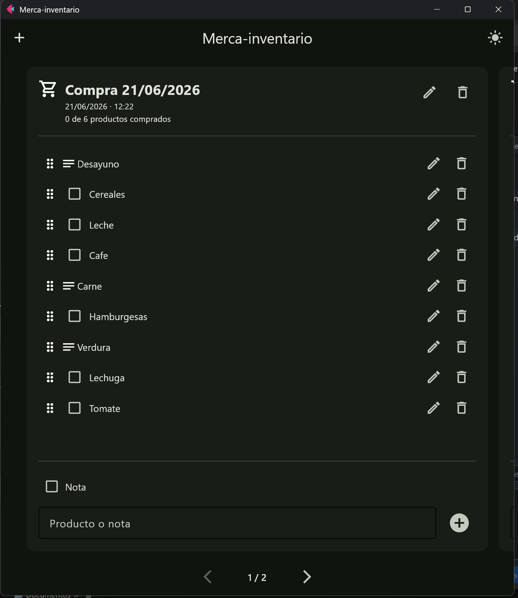

# Merca-inventario

Aplicación Android hecha con Python y Flet. Todas las listas, sus elementos, el orden de estos y la preferencia de modo oscuro se guardan en un archivo JSON dentro del almacenamiento privado de la aplicación.

## Funciones incluidas

- Histórico de listas mediante tarjetas laterales.
- Deslizamiento táctil en Android.
- Navegación lateral mediante gesto, arrastre de la cabecera y flechas.
- Modo oscuro persistente.
- Productos marcables y notas.
- Edición y eliminación de productos y notas.
- Edición del título de cada tarjeta.
- Creación de nuevas tarjetas a la derecha de la tarjeta actual.
- Botón para crear tarjetas situado arriba a la izquierda.
- Reordenación mediante el asa situada a la izquierda de cada elemento.
- Funcionamiento completamente local, sin servidor.

## Previsualizacion



## Ejecutar en el ordenador

```bash
python -m venv .venv
```

Windows PowerShell:

```powershell
.\.venv\Scripts\Activate.ps1
```

Linux/macOS:

```bash
source .venv/bin/activate
```

Instalar y ejecutar:

```bash
python -m pip install --upgrade pip
python -m pip install "flet[all]==0.85.3"
flet run
```

## Crear APK

```bash
flet build apk
```

El APK se generará normalmente dentro de `build/apk/`.
